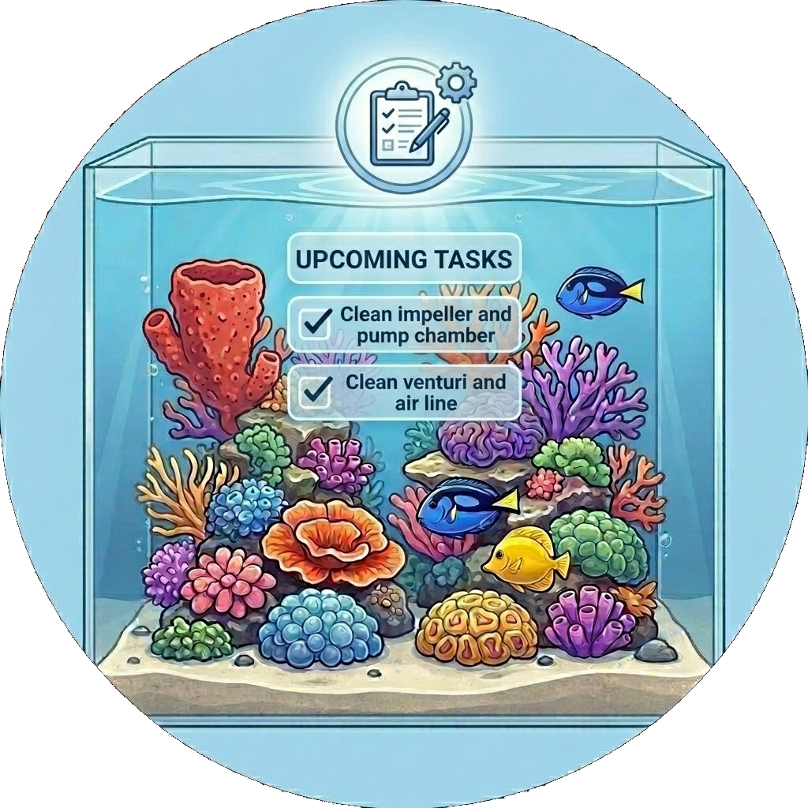

# Reef maintenance 🐙
> Part of the [**ReefTech Project Ecosystem**](https://elwinmage.github.io/reeftank/)
<p align="center">
  
</p>

[](https://github.com/hacs/hacs)
[](https://developers.home-assistant.io/docs/architecture_index/#branding)
[](https://github.com/Elwinmage/ha-reef-maintenance-component/releases)

[](https://github.com/Elwinmage/ha-reef-maintenance-component/actions/workflows/main.yml)
[](https://github.com/Elwinmage/ha-reef-maintenance-component/actions/workflows/hass_and_hacs.yml)
[](https://app.codecov.io/gh/Elwinmage/ha-reef-maintenance-component)
[](https://github.com/Elwinmage/ha-reef-maintenance-component/commits/main)
[](https://github.com/MShawon/github-clone-count-badge)
[](https://opensource.org/licenses/MIT)
[](https://github.com/Elwinmage/ha-reef-maintenance-component)
[](https://paypal.me/Elwinmage)

# Supported Languages:  [](https://github.com/Elwinmage/ha-reef-maintenance-component/blob/main/doc/fr/README.fr.md) [](https://github.com/Elwinmage/ha-reef-maintenance-component/blob/main/doc/de/README.de.md) [](https://github.com/Elwinmage/ha-reef-maintenance-component/blob/main/doc/es/README.es.md) [](https://github.com/Elwinmage/ha-reef-maintenance-component/blob/main/doc/it/README.it.md) [](https://github.com/Elwinmage/ha-reef-maintenance-component/blob/main/doc/nl/README.nl.md) [](https://github.com/Elwinmage/ha-reef-maintenance-component/blob/main/doc/pl/README.pl.md) [](https://github.com/Elwinmage/ha-reef-maintenance-component/blob/main/doc/pt/README.pt.md)

Home Assistant integration that tracks cleaning and wear tasks for aquarium equipment Home Assistant **cannot talk to** — flow pumps, return pumps, skimmers, media reactors, anything you clean by hand.

It publishes the same `reef_role` entity contract as the two connected-device integrations, so its tasks show up in the maintenance view of the card next to the connected gear, with no card-side configuration.

<!-- ecosystem:start -->

## Related projects

The ReefTech projects fit together: the integrations bring your equipment into Home Assistant, the card displays and drives it, and the backup keeps it running through an outage. Each one also works on its own.

<table>
  <tr>
    <th width="100px"></th>
    <th>Project</th>
    <th>What it does</th>
    <th>Works with</th>
  </tr>
  <tr>
    <td></td>
    <td><a href="https://github.com/Elwinmage/ha-reefbeat-component"><b>ha-reefbeat-component</b></a></td>
    <td>Red Sea ReefBeat devices, controlled locally with no cloud: ReefATO+, ReefControl, ReefControl-Power, ReefDose, ReefLed, ReefMat, ReefRun and ReefWave.<br />alert blueprint for abnormal modes, calibrations and low battery. <a href="https://my.home-assistant.io/redirect/blueprint_import/?blueprint_url=https://raw.githubusercontent.com/Elwinmage/ha-reefbeat-component/refs/heads/main/blueprints/automation/redsea_alerts.en.yaml"></a></td>
    <td>ha-reef-card</td>
  </tr>
  <tr>
    <td></td>
    <td><a href="https://github.com/Elwinmage/ha-aquamedic-component"><b>ha-aquamedic-component</b></a></td>
    <td>Aqua Medic pumps through the Gizwits cloud API: EcoDrift and SmartDrift wavemakers, DC Runner return and skimmer pumps.</td>
    <td>ha-reef-card</td>
  </tr>
  <tr>
    <td></td>
    <td><b>ha-reef-maintenance-component</b><br /><i>(this repository)</i></td>
    <td>Cleaning and wear tracking for the equipment Home Assistant cannot talk to: flow pumps, return pumps, skimmers, media reactors, anything you service by hand.</td>
    <td>ha-reef-card</td>
  </tr>
  <tr>
    <td></td>
    <td><a href="https://github.com/Elwinmage/ha-reef-card"><b>ha-reef-card</b></a></td>
    <td>Interactive graphical view of each device on your dashboard, and the only way to edit advanced schedules. Reads the three integrations above through the shared <code>reef_role</code> contract, with no card-side configuration.</td>
    <td>all three integrations</td>
  </tr>
  <tr>
    <td></td>
    <td><a href="https://github.com/Elwinmage/ha-reef-blueprints"><b>ha-reef-blueprints</b></a></td>
    <td>Notification blueprints shared by the whole ecosystem: overdue maintenance found through the <code>reef_role</code> contract, and devices that went unreachable. Eight languages.</td>
    <td>all three integrations</td>
  </tr>
  <tr>
    <td></td>
    <td><a href="https://github.com/Elwinmage/reefbeatEnergyBackup"><b>reefbeatEnergyBackup</b></a></td>
    <td>Battery backup for power outages. A 24V LiFePO₄ pack driven by a Raspberry Pi, with pump speed degraded progressively according to the state of charge.</td>
    <td>standalone, or alongside ha-reefbeat-component</td>
  </tr>
</table>

All of them are documented together on the [ReefTech project page](https://elwinmage.github.io/reeftank/).

<!-- ecosystem:end -->

## With ha-reef-card

<p align="center">
  
</p>

The maintenance view of [ha-reef-card](https://github.com/Elwinmage/ha-reef-card) gathers every task from this integration alongside those of the connected devices. Sort by equipment or by due date, overdue first; press a row and the job is recorded.

Nothing to set up on the card side: it finds the tasks through the `reef_role` attribute, so an equipment added here appears there on the next refresh.

Overdue tasks can also reach your phone: the [Reef maintenance watch](https://github.com/Elwinmage/ha-reef-blueprints) blueprint finds them through the same `reef_role` attribute and honours the per-task notification switches.

[](https://www.youtube.com/watch?v=__A_DEFINIR__)

## How it works

One config entry per **brand**, one device per **equipment**, four entities per **task**:

| Entity | Role |
|---|---|
| Button | Records that the job is done, and carries `days_left`, `overdue`, `interval_days`, `task_key`, `notify` as attributes |
| Number | Interval, in the task's natural unit (days, weeks or months) |
| Switch | Mutes overdue alerts for that task |
| Date | Backdates the last intervention |

The date entity matters more than it looks: without it every task starts from "never done" the day you add the equipment, and they all fall due the same afternoon three months later.

## Presets

| Brand | Model | Tasks |
|---|---|---|
| Tunze | Turbelle stream / stream 3 | pump, magnet holder, descale, wear parts |
| Tunze | Turbelle nanostream | pump, magnet holder, descale, wear parts |
| Tunze | Silence / Silence PRO | strainer, pump, descale, wear parts |
| Jebao | SLW / MLW / SCP / SOW | pump, magnet holder, descale, wear parts |
| Jebao | DCP / MDP | strainer, pump, descale, wear parts |
| Generic | DC flow pump | pump, magnet holder, descale, wear parts |
| Generic | DC return pump | strainer, pump, descale, wear parts |
| Generic | Needle wheel skimmer | cup, venturi, needle wheel, descale, wear parts |
| Generic | Custom equipment | none — pick from the library or type your own |

Preset intervals follow the manufacturer whenever one publishes a figure (Tunze Turbelle: pump and magnet holder every 1–2 months; Tunze Silence: full clean at least yearly; Jebao DCP: monthly impeller cleaning; Jebao SLW: monthly to bi-monthly) and reef keeping practice otherwise. All of them are starting points you can change per equipment.

Tasks come from a shared library of 17 entries, translated in 8 languages. A preset only references library keys and may override the interval bounds — which is why adding a brand usually costs no new translation string.

## Service

`reef_maintenance.reset` marks a task done from an automation. Stick an NFC tag next to the pump, scan it when you are done, and the task is acknowledged without opening a dashboard.

```yaml
action: reef_maintenance.reset
target:
  entity_id: button.brassage_gauche_nettoyer_le_rotor_et_la_chambre_de_pompe
```

## Development

`scripts/gen_readme.py` regenerates this page and its seven translations, and `scripts/gen_translations.py` regenerates `strings.json` and the 8 locale files from a single source table — 800+ strings composed from one wording per task per language. Run them after touching the task library, and commit the result.

### Tests

```bash
pip install -r requirements.test.txt
pytest -q --cov=custom_components.reef_maintenance --cov-config=.coveragerc \
       --cov-report=term-missing
```

The suite covers the package fully and CI keeps it that way. It is worth knowing what it is guarding, because most of it is invisible at runtime:

- **Task keys and units.** A key lands in the entity `unique_id` and in the storage key, so renaming one loses the user's reset history. A wrong unit silently changes what an interval slider means.
- **`reef_role`.** The attribute ha-reef-card scans for. If its prefix changes, the maintenance view goes empty with no error anywhere.
- **Day arithmetic.** `compute_days_left` rounds away from zero in both directions, and "never reset" is `None` rather than overdue. Every consumer reads those values.
- **Slug collisions.** Two custom tasks whose labels slugify identically would share a `unique_id`, and Home Assistant would drop one of the two entity sets without saying so.
